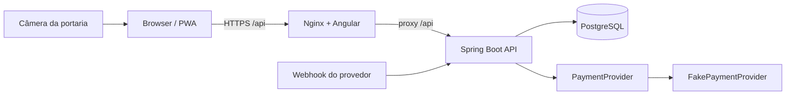

# Arquitetura

## Visão geral

A aplicação é um monólito modular transacional. Essa escolha mantém pedidos, estoque, pagamento, emissão e check-in no mesmo limite de consistência, simplificando a primeira versão sem impedir a extração futura de módulos.

## Módulos backend

- `security`: principal multiempresa, JWT e filtro de autenticação.
- `service`: regras transacionais de checkout, pagamento, emissão, reembolso, convite e check-in.
- `payment`: abstração de provedor e implementação fake.
- `repository`: queries de tenant, locks pessimistas e update atômico.
- `web`: REST, validação, autorização e erros padronizados.
- `config`: CORS, headers, rate limit, dados de desenvolvimento e validação de segredos.

## Multi-tenancy

O usuário global se relaciona com organizações por `organization_members`. O token contém o tenant selecionado, mas cada requisição recarrega e valida a associação ativa. Serviços administrativos consultam recursos por `organization_id` ou por navegação até a organização. A troca de organização emite um novo par de tokens.

## Autenticação

1. BCrypt valida a senha.
2. A associação ativa inicial define organização e perfil.
3. O access token JWT expira rapidamente.
4. O refresh token aleatório é armazenado apenas como SHA-256, associado ao usuário e organização.
5. O refresh anterior é revogado na rotação.
6. Logout revoga o refresh token apresentado.

## Frontend

O Angular usa componentes standalone, lazy loading, Signals para estado local, Reactive Forms, interceptor de autenticação e guards. Taiga UI é o único design system. O Nginx entrega o SPA e encaminha `/api` ao backend.

## Decisões principais

- `BigDecimal` e `NUMERIC(15,2)` para dinheiro.
- UUID em entidades e códigos públicos aleatórios para URLs.
- Pessimistic lock para reservar e converter estoque.
- Webhook idempotente com `ON CONFLICT DO NOTHING`.
- HMAC-SHA-256 determinístico para reconstruir o token sem persistir o segredo em texto puro.
- SQL atômico para impedir duas portarias de aprovarem o mesmo ingresso.
