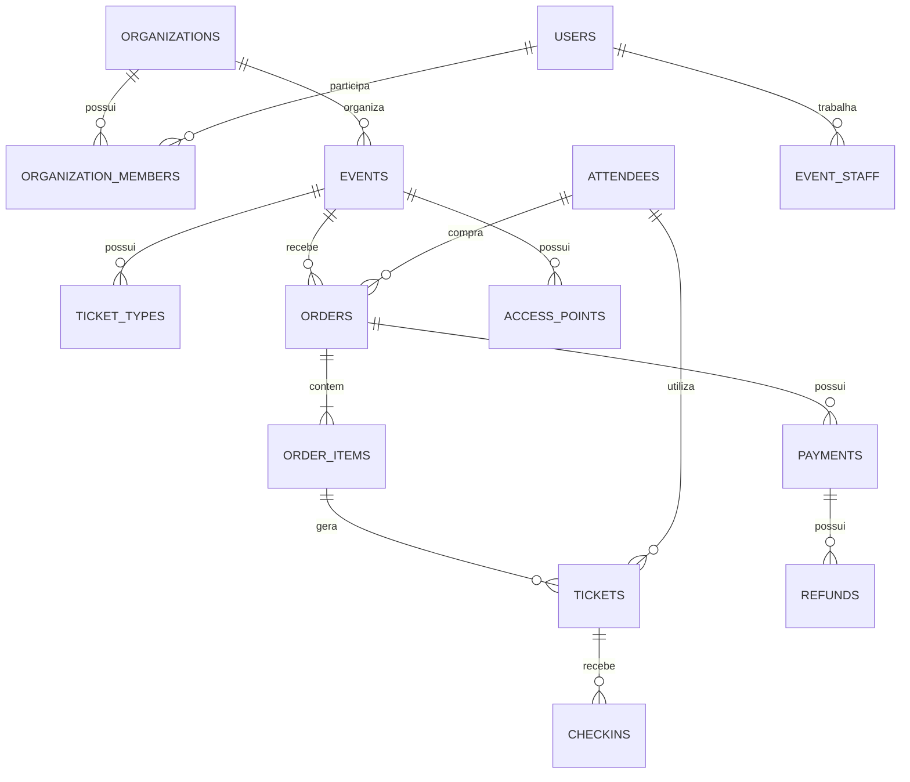

# Banco de dados

O schema é criado por `backend/src/main/resources/db/migration/V1__schema.sql`. Todas as entidades principais usam UUID, timestamps com fuso e valores monetários `NUMERIC(15,2)`.

## Integridade

- Unicidade por organização para slug de evento.
- Estoque nunca pode ficar negativo nem superar a quantidade total.
- Datas do evento exigem `ends_at > starts_at`.
- Chaves de idempotência de pagamento e eventos de webhook são únicas.
- Hash de QR Code e códigos públicos são únicos.
- Índice parcial impede duas autorizações globais iguais de funcionário sem portaria.

## Dados pessoais

O documento não é salvo em texto puro. Quando informado, ele é normalizado, cifrado em AES-GCM e recebe SHA-256 separado para busca exata ou prevenção de duplicidade. As APIs administrativas retornam somente valor mascarado.

## Índices

A migration inclui índices simples e compostos para tenant/status, eventos, pedidos, pagamentos, ingressos, check-ins, participantes, auditoria, refresh token e recuperação de senha.
