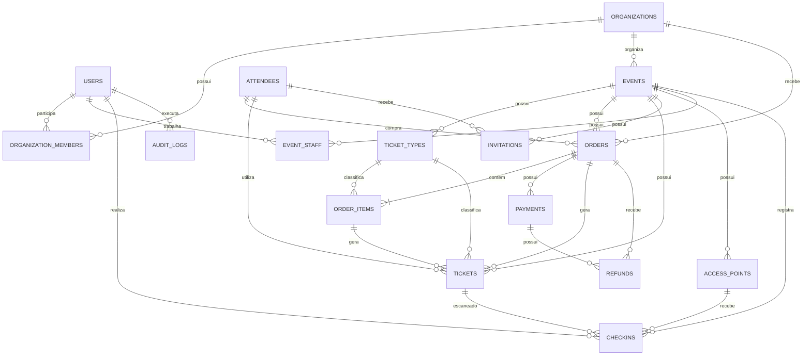

# PROMPT DEFINITIVO — PLATAFORMA DE INGRESSOS, PAGAMENTO PIX E CONTROLE DE ACESSO POR QR CODE

Atuolvedor Full Stack Sênior**, especializado em:

* Java 21.
* Spring Boot 3.
* Spring Security.
* PostgreSQL.
* Angular com componentes standalone.
* Taiga UI.
* Sistemas de pagamento.
* Integração Pix.
* QR Code.
* Sistemas SaaS multiempresa.
* Docker.
* Testes automatizados.
* Segurança e proteção de dados.

Sua responsabilidade não é apenas explicar a solução.

Você deve **criar o projeto completo, funcional, integrado, testado e pronto para execução**, contendo backend e frontend no mesmo repositório.

Ao finalizar, entregue tudo dentro de um único arquivo:

```text
event-access-platform.zip
```

O projeto deve funcionar localmente com:

```bash
docker compose up --build
```

Após a inicialização:

```text
Frontend: http://localhost:4200
Backend: http://localhost:8080
Swagger: http://localhost:8080/swagger-ui/index.html
```

Não entregue somente trechos de código, exemplos isolados, wireframes ou documentação.

Entregue uma aplicação **plug and play**, com frontend consumindo realmente o backend.

---

# 1. OBJETIVO DO PRODUTO

Criar uma plataforma web SaaS para:

* Criação de festas e eventos.
* Venda de ingressos.
* Checkout online.
* Pagamento via Pix.
* Confirmação automática do pagamento.
* Geração de ingresso digital.
* Geração de QR Code individual.
* Identificação do participante.
* Controle de pulseiras ou tags.
* Escaneamento do QR Code na portaria.
* Controle contra reutilização.
* Cadastro de convidados.
* Controle de funcionários.
* Controle de diferentes entradas e portarias.
* Relatórios financeiros.
* Relatórios de acesso.
* Dashboard do organizador.

O sistema deverá atender diferentes empresas organizadoras.

Cada organização poderá ter seus próprios:

* Usuários.
* Funcionários.
* Eventos.
* Tipos de ingresso.
* Participantes.
* Pedidos.
* Pagamentos.
* Portarias.
* Relatórios.

Os dados de uma organização nunca poderão ser acessados por outra organização.

---

# 2. EXEMPLO DE NEGÓCIO

Um organizador cria uma festa com duas categorias:

## Ingresso comum

```text
Categoria: Comum
Preço: R$ 50,00
Pulseira: Branca
Capacidade: 500 pessoas
```

## Ingresso premium

```text
Categoria: Premium
Preço: R$ 150,00
Pulseira: Preta
Capacidade: 100 pessoas
```

O participante compra o ingresso pelo checkout.

Depois da confirmação do Pix:

* O pedido é marcado como pago.
* O ingresso é emitido.
* Um QR Code único é gerado.
* O ingresso é disponibilizado para o participante.

Na portaria, um funcionário escaneia o QR Code pelo celular.

O sistema exibe:

```text
ENTRADA LIBERADA

Participante: João da Silva
Ingresso: Premium
Pagamento: Confirmado
Pulseira: Preta
Evento: Festa de Verão
Horário: 22:35
```

Depois da entrada, o ingresso passa para utilizado.

Uma segunda tentativa deverá mostrar:

```text
ENTRADA NEGADA

Ingresso já utilizado.
Primeira entrada registrada às 22:35.
Portaria: Entrada Principal.
```

---

# 3. STACK OBRIGATÓRIA

## Backend

Utilizar:

* Java 21.
* Spring Boot 3.
* Maven.
* Spring Web.
* Spring Security.
* Spring Data JPA.
* Hibernate.
* Bean Validation.
* PostgreSQL.
* Flyway.
* JWT com access token e refresh token.
* OpenAPI/Swagger.
* MapStruct ou mapeamento manual organizado.
* JUnit 5.
* Mockito.
* Testcontainers.
* Docker.

## Frontend

Utilizar:

* Angular na versão estável compatível com o Taiga UI escolhido.
* TypeScript.
* Angular standalone components.
* Angular Router.
* Reactive Forms.
* Angular Signals quando apropriado.
* HttpClient.
* Interceptors.
* Guards.
* Taiga UI.
* SCSS.
* PWA preparada para dispositivos móveis.

## Design system obrigatório

Utilizar o **Taiga UI** como biblioteca principal e exclusiva de componentes visuais.

Consultar a documentação oficial:

```text
https://taiga-ui.dev/components
```

Utilizar os pacotes oficiais compatíveis necessários, incluindo:

```text
@taiga-ui/core
@taiga-ui/kit
@taiga-ui/cdk
```

Utilizar outros pacotes oficiais do Taiga UI somente quando necessários e compatíveis com a versão escolhida.

Não utilizar:

* Angular Material.
* Bootstrap.
* PrimeNG.
* Nebular.
* Ant Design.
* Outras bibliotecas concorrentes de componentes.
* Templates administrativos prontos de terceiros.
* Componentes visuais duplicando algo já existente no Taiga UI.

O CSS e SCSS personalizados deverão ser usados apenas para:

* Layout.
* Espaçamento.
* Responsividade.
* Identidade visual.
* Ajustes que não sejam atendidos pelo Taiga UI.

Sempre que existir um componente equivalente no Taiga UI, utilizar o componente oficial em vez de criar um componente visual do zero.

---

# 4. PADRÃO VISUAL DA INTERFACE

Criar uma interface:

* Limpa.
* Moderna.
* Profissional.
* Minimalista.
* Responsiva.
* Consistente.
* Fácil de utilizar.
* Preparada para desktop, tablet e celular.
* Adequada para ambientes com pouca iluminação.
* Adequada para uso rápido na portaria.

A interface deve possuir:

* Hierarquia visual clara.
* Espaçamento consistente.
* Tipografia legível.
* Ícones consistentes.
* Feedback visual imediato.
* Estados de carregamento.
* Estados vazios.
* Estados de erro.
* Confirmações para ações destrutivas.
* Mensagens de sucesso.
* Skeleton loading quando apropriado.
* Validação visual de formulários.
* Acessibilidade por teclado.
* Labels corretamente associados.
* Contraste adequado.
* Layout responsivo.

Implementar:

* Tema claro.
* Tema escuro.
* Alternância de tema.
* Persistência da preferência do usuário.
* Cores configuráveis por organização, sem comprometer acessibilidade.

---

# 5. COMPONENTES TAIGA UI

Utilizar componentes prontos do Taiga UI para construir:

* Botões.
* Campos de texto.
* Campos monetários.
* Campos de telefone.
* Campos de data.
* Campos de horário.
* Selects.
* Comboboxes.
* Checkboxes.
* Radio buttons.
* Textareas.
* Chips.
* Badges.
* Tooltips.
* Breadcrumbs.
* Tabs.
* Paginação.
* Tabelas.
* Menus.
* Dropdowns.
* Diálogos.
* Drawers.
* Notificações.
* Alerts.
* Cards.
* Loaders.
* Skeletons.
* Stepper.
* Accordion.
* Calendários.
* Filtros.
* Inputs de pesquisa.
* Navegação principal.
* Ícones.
* Confirmações.

Utilizar o padrão de navegação do Taiga UI para construir o painel administrativo.

Não criar botões, modais, inputs, selects ou notificações com HTML puro quando houver componente correspondente no Taiga UI.

Configurar corretamente o componente raiz e os providers necessários conforme a versão utilizada.

---

# 6. ESTRUTURA DO REPOSITÓRIO

Criar um único repositório com a seguinte estrutura:

```text
event-access-platform/
├── backend/
│   ├── pom.xml
│   ├── Dockerfile
│   ├── src/
│   └── README.md
├── frontend/
│   ├── package.json
│   ├── angular.json
│   ├── Dockerfile
│   ├── nginx.conf
│   ├── proxy.conf.json
│   ├── src/
│   └── README.md
├── infrastructure/
│   ├── postgres/
│   └── scripts/
├── docs/
│   ├── architecture.md
│   ├── database.md
│   ├── api.md
│   ├── payment-flow.md
│   └── checkin-flow.md
├── docker-compose.yml
├── .env.example
├── Makefile
├── start.sh
├── start.ps1
└── README.md
```

O ZIP final deve conter a pasta raiz completa.

Não gerar dois arquivos ZIP separados.

---

# 7. INTEGRAÇÃO ENTRE FRONTEND E BACKEND

O frontend Angular deve consumir a API Spring Boot de verdade.

Não utilizar arrays fixos ou dados mockados no frontend como fonte principal.

Não deixar telas desconectadas.

Todos os recursos devem possuir integração real com a API.

## Desenvolvimento local

Utilizar um arquivo:

```text
frontend/proxy.conf.json
```

Configurar o Angular para encaminhar:

```text
/api
```

para:

```text
http://localhost:8080
```

## Docker e produção

Utilizar Nginx para servir o frontend e encaminhar as requisições:

```text
/api/*
```

para o serviço do backend.

O frontend deve utilizar URLs relativas:

```text
/api/auth/login
/api/events
/api/orders
```

Não adicionar URLs do backend diretamente nos componentes.

Não utilizar:

```text
http://localhost:8080
```

espalhado pelo código do frontend.

Centralizar a configuração de ambiente.

---

# 8. EXECUÇÃO PLUG AND PLAY

O projeto deve iniciar com:

```bash
docker compose up --build
```

O Docker Compose deverá iniciar:

* PostgreSQL.
* Backend Spring Boot.
* Frontend Angular compilado e servido por Nginx.

Adicionar:

* Health check do PostgreSQL.
* Health check do backend.
* Dependência entre os containers.
* Variáveis de ambiente.
* Volume persistente do PostgreSQL.
* Rede interna.
* Reinicialização segura.
* Migrations automáticas.
* Dados iniciais de desenvolvimento.

O frontend deve aguardar o backend ficar disponível.

O backend deve aguardar o PostgreSQL ficar disponível.

---

# 9. CONFIGURAÇÃO DE AMBIENTE

Criar `.env.example` contendo:

```text
POSTGRES_DB=event_access
POSTGRES_USER=event_access
POSTGRES_PASSWORD=event_access
SPRING_DATASOURCE_URL=jdbc:postgresql://postgres:5432/event_access
SPRING_DATASOURCE_USERNAME=event_access
SPRING_DATASOURCE_PASSWORD=event_access
JWT_SECRET=change-this-secret
JWT_ACCESS_EXPIRATION=900
JWT_REFRESH_EXPIRATION=604800
PAYMENT_PROVIDER=FAKE
APP_BASE_URL=http://localhost:4200
BACKEND_BASE_URL=http://localhost:8080
```

Não incluir segredos reais.

Adicionar validação para impedir inicialização em produção com segredos inseguros.

---

# 10. USUÁRIOS INICIAIS

Criar dados de demonstração por migration ou initializer de desenvolvimento.

## Administrador da plataforma

```text
E-mail: admin@eventaccess.local
Senha: Admin@123
Perfil: SUPER_ADMIN
```

## Organizador

```text
E-mail: organizer@eventaccess.local
Senha: Organizer@123
Perfil: ORGANIZER_ADMIN
```

## Funcionário da portaria

```text
E-mail: door@eventaccess.local
Senha: Door@123
Perfil: DOOR_STAFF
```

Essas credenciais devem funcionar somente no ambiente de desenvolvimento.

Exibir as credenciais no README.

---

# 11. PERFIS E AUTORIZAÇÕES

Implementar:

## SUPER_ADMIN

Pode:

* Administrar todas as organizações.
* Suspender organizações.
* Consultar eventos.
* Consultar logs.
* Administrar usuários da plataforma.

## ORGANIZER_ADMIN

Pode:

* Administrar sua organização.
* Criar eventos.
* Criar tipos de ingresso.
* Administrar funcionários.
* Consultar pedidos.
* Consultar pagamentos.
* Solicitar reembolsos.
* Consultar relatórios.
* Configurar portarias.

## EVENT_MANAGER

Pode:

* Administrar eventos autorizados.
* Administrar ingressos.
* Administrar participantes.
* Consultar check-ins.
* Consultar relatórios operacionais.

## DOOR_STAFF

Pode:

* Selecionar o evento autorizado.
* Selecionar a portaria.
* Escanear QR Codes.
* Realizar pesquisa manual.
* Consultar informações mínimas do ingresso.

Não pode:

* Consultar faturamento.
* Alterar preços.
* Reembolsar pedidos.
* Administrar usuários.

## FINANCE

Pode:

* Consultar pedidos.
* Consultar pagamentos.
* Consultar reembolsos.
* Consultar relatórios financeiros.

## VIEWER

Pode apenas visualizar os recursos autorizados.

---

# 12. MODELO RELACIONAL

Todas as tabelas principais devem utilizar:

```text
id UUID PRIMARY KEY
created_at TIMESTAMPTZ NOT NULL
updated_at TIMESTAMPTZ
```

Valores financeiros devem utilizar:

```text
NUMERIC(15,2)
```

Nunca utilizar `FLOAT` ou `DOUBLE` para dinheiro.

---

# 13. TABELA ORGANIZATIONS

```text
organizations
-------------
id UUID PK
name VARCHAR(150) NOT NULL
legal_name VARCHAR(200)
document_number VARCHAR(20)
email VARCHAR(150)
phone VARCHAR(30)
slug VARCHAR(100) UNIQUE NOT NULL
status VARCHAR(30) NOT NULL
logo_url VARCHAR(500)
primary_color VARCHAR(7)
timezone VARCHAR(50) NOT NULL
created_at TIMESTAMPTZ NOT NULL
updated_at TIMESTAMPTZ
```

Status:

```text
ACTIVE
SUSPENDED
INACTIVE
```

---

# 14. TABELA USERS

```text
users
-----
id UUID PK
name VARCHAR(150) NOT NULL
email VARCHAR(150) UNIQUE NOT NULL
phone VARCHAR(30)
password_hash VARCHAR(255) NOT NULL
status VARCHAR(30) NOT NULL
last_login_at TIMESTAMPTZ
created_at TIMESTAMPTZ NOT NULL
updated_at TIMESTAMPTZ
```

Status:

```text
ACTIVE
BLOCKED
PENDING_ACTIVATION
INACTIVE
```

---

# 15. TABELA ORGANIZATION_MEMBERS

```text
organization_members
--------------------
id UUID PK
organization_id UUID NOT NULL FK organizations(id)
user_id UUID NOT NULL FK users(id)
role VARCHAR(30) NOT NULL
status VARCHAR(30) NOT NULL
created_at TIMESTAMPTZ NOT NULL
updated_at TIMESTAMPTZ
UNIQUE (organization_id, user_id)
```

Relacionamento:

```text
organizations N:N users
```

implementado por `organization_members`.

---

# 16. TABELA EVENTS

```text
events
------
id UUID PK
organization_id UUID NOT NULL FK organizations(id)
name VARCHAR(200) NOT NULL
slug VARCHAR(150) NOT NULL
description TEXT
venue_name VARCHAR(200)
address VARCHAR(300)
city VARCHAR(100)
state VARCHAR(50)
country VARCHAR(50)
starts_at TIMESTAMPTZ NOT NULL
ends_at TIMESTAMPTZ NOT NULL
sales_start_at TIMESTAMPTZ
sales_end_at TIMESTAMPTZ
capacity INTEGER
status VARCHAR(30) NOT NULL
banner_url VARCHAR(500)
require_document BOOLEAN NOT NULL DEFAULT FALSE
allow_manual_checkin BOOLEAN NOT NULL DEFAULT TRUE
terms_url VARCHAR(500)
created_at TIMESTAMPTZ NOT NULL
updated_at TIMESTAMPTZ
UNIQUE (organization_id, slug)
CHECK (ends_at > starts_at)
CHECK (capacity IS NULL OR capacity > 0)
```

Status:

```text
DRAFT
PUBLISHED
SALES_OPEN
SALES_CLOSED
IN_PROGRESS
FINISHED
CANCELED
```

---

# 17. TABELA TICKET_TYPES

```text
ticket_types
------------
id UUID PK
event_id UUID NOT NULL FK events(id)
name VARCHAR(100) NOT NULL
description TEXT
category VARCHAR(50) NOT NULL
price NUMERIC(15,2) NOT NULL
service_fee NUMERIC(15,2) NOT NULL DEFAULT 0
total_quantity INTEGER NOT NULL
sold_quantity INTEGER NOT NULL DEFAULT 0
reserved_quantity INTEGER NOT NULL DEFAULT 0
max_per_order INTEGER NOT NULL DEFAULT 1
wristband_label VARCHAR(100)
wristband_color_name VARCHAR(50)
wristband_color_hex VARCHAR(7)
sales_start_at TIMESTAMPTZ
sales_end_at TIMESTAMPTZ
status VARCHAR(30) NOT NULL
sort_order INTEGER NOT NULL DEFAULT 0
created_at TIMESTAMPTZ NOT NULL
updated_at TIMESTAMPTZ
CHECK (price >= 0)
CHECK (service_fee >= 0)
CHECK (total_quantity > 0)
CHECK (sold_quantity >= 0)
CHECK (reserved_quantity >= 0)
CHECK (sold_quantity <= total_quantity)
CHECK (max_per_order > 0)
```

Status:

```text
DRAFT
ACTIVE
SOLD_OUT
PAUSED
CLOSED
CANCELED
```

---

# 18. TABELA ATTENDEES

```text
attendees
---------
id UUID PK
name VARCHAR(150) NOT NULL
email VARCHAR(150)
phone VARCHAR(30)
document_type VARCHAR(20)
document_number_encrypted TEXT
document_number_hash VARCHAR(255)
birth_date DATE
accepted_terms_at TIMESTAMPTZ
accepted_privacy_at TIMESTAMPTZ
created_at TIMESTAMPTZ NOT NULL
updated_at TIMESTAMPTZ
```

Regras:

* Não armazenar documentos sensíveis em texto puro.
* Criptografar o documento quando necessário.
* Utilizar hash para busca e prevenção de duplicidade.
* Mascarar o documento no frontend.
* Não incluir informações pessoais no QR Code.

---

# 19. TABELA ORDERS

```text
orders
------
id UUID PK
organization_id UUID NOT NULL FK organizations(id)
event_id UUID NOT NULL FK events(id)
buyer_attendee_id UUID NOT NULL FK attendees(id)
public_code VARCHAR(30) UNIQUE NOT NULL
status VARCHAR(30) NOT NULL
subtotal NUMERIC(15,2) NOT NULL
service_fee NUMERIC(15,2) NOT NULL DEFAULT 0
discount_amount NUMERIC(15,2) NOT NULL DEFAULT 0
total_amount NUMERIC(15,2) NOT NULL
currency VARCHAR(3) NOT NULL DEFAULT 'BRL'
expires_at TIMESTAMPTZ
paid_at TIMESTAMPTZ
canceled_at TIMESTAMPTZ
refunded_at TIMESTAMPTZ
source VARCHAR(30) NOT NULL
created_at TIMESTAMPTZ NOT NULL
updated_at TIMESTAMPTZ
CHECK (subtotal >= 0)
CHECK (service_fee >= 0)
CHECK (discount_amount >= 0)
CHECK (total_amount >= 0)
```

Status:

```text
PENDING_PAYMENT
PAID
PAYMENT_FAILED
EXPIRED
CANCELED
PARTIALLY_REFUNDED
REFUNDED
```

Origem:

```text
ONLINE_CHECKOUT
ADMIN
DOOR_SALE
INVITATION
```

---

# 20. TABELA ORDER_ITEMS

```text
order_items
-----------
id UUID PK
order_id UUID NOT NULL FK orders(id)
ticket_type_id UUID NOT NULL FK ticket_types(id)
quantity INTEGER NOT NULL
unit_price NUMERIC(15,2) NOT NULL
service_fee_unit NUMERIC(15,2) NOT NULL DEFAULT 0
discount_amount NUMERIC(15,2) NOT NULL DEFAULT 0
total_amount NUMERIC(15,2) NOT NULL
created_at TIMESTAMPTZ NOT NULL
updated_at TIMESTAMPTZ
CHECK (quantity > 0)
CHECK (unit_price >= 0)
CHECK (service_fee_unit >= 0)
CHECK (discount_amount >= 0)
CHECK (total_amount >= 0)
```

---

# 21. TABELA PAYMENTS

```text
payments
--------
id UUID PK
order_id UUID NOT NULL FK orders(id)
provider VARCHAR(50) NOT NULL
payment_method VARCHAR(30) NOT NULL
provider_payment_id VARCHAR(150)
idempotency_key VARCHAR(150) UNIQUE NOT NULL
status VARCHAR(30) NOT NULL
amount NUMERIC(15,2) NOT NULL
currency VARCHAR(3) NOT NULL DEFAULT 'BRL'
pix_copy_paste TEXT
pix_qr_code_url VARCHAR(500)
expires_at TIMESTAMPTZ
approved_at TIMESTAMPTZ
failed_at TIMESTAMPTZ
refunded_at TIMESTAMPTZ
failure_reason VARCHAR(500)
provider_response JSONB
created_at TIMESTAMPTZ NOT NULL
updated_at TIMESTAMPTZ
CHECK (amount >= 0)
```

Métodos:

```text
PIX
CREDIT_CARD
DEBIT_CARD
CASH
COURTESY
```

Status:

```text
CREATED
PENDING
APPROVED
FAILED
CANCELED
EXPIRED
PARTIALLY_REFUNDED
REFUNDED
```

---

# 22. TABELA PAYMENT_WEBHOOKS

```text
payment_webhooks
----------------
id UUID PK
provider VARCHAR(50) NOT NULL
provider_event_id VARCHAR(150) NOT NULL
event_type VARCHAR(100)
payload JSONB NOT NULL
signature VARCHAR(500)
status VARCHAR(30) NOT NULL
received_at TIMESTAMPTZ NOT NULL
processed_at TIMESTAMPTZ
error_message TEXT
created_at TIMESTAMPTZ NOT NULL
UNIQUE (provider, provider_event_id)
```

Status:

```text
RECEIVED
PROCESSING
PROCESSED
IGNORED
FAILED
```

---

# 23. TABELA TICKETS

Cada ingresso deve possuir um registro individual.

```text
tickets
-------
id UUID PK
event_id UUID NOT NULL FK events(id)
ticket_type_id UUID NOT NULL FK ticket_types(id)
order_id UUID NOT NULL FK orders(id)
order_item_id UUID NOT NULL FK order_items(id)
attendee_id UUID NOT NULL FK attendees(id)
public_code VARCHAR(40) UNIQUE NOT NULL
qr_token_hash VARCHAR(255) UNIQUE NOT NULL
status VARCHAR(30) NOT NULL
issued_at TIMESTAMPTZ
valid_from TIMESTAMPTZ
valid_until TIMESTAMPTZ
checked_in_at TIMESTAMPTZ
blocked_at TIMESTAMPTZ
block_reason VARCHAR(500)
canceled_at TIMESTAMPTZ
version BIGINT NOT NULL DEFAULT 0
created_at TIMESTAMPTZ NOT NULL
updated_at TIMESTAMPTZ
```

Status:

```text
PENDING_PAYMENT
VALID
USED
BLOCKED
CANCELED
REFUNDED
EXPIRED
```

O campo `version` deverá ser utilizado quando for adotado controle otimista de concorrência.

---

# 24. TABELA INVITATIONS

```text
invitations
-----------
id UUID PK
event_id UUID NOT NULL FK events(id)
ticket_type_id UUID FK ticket_types(id)
attendee_id UUID NOT NULL FK attendees(id)
invited_by_user_id UUID NOT NULL FK users(id)
code VARCHAR(50) UNIQUE NOT NULL
status VARCHAR(30) NOT NULL
expires_at TIMESTAMPTZ
accepted_at TIMESTAMPTZ
converted_order_id UUID FK orders(id)
created_at TIMESTAMPTZ NOT NULL
updated_at TIMESTAMPTZ
```

Status:

```text
PENDING
ACCEPTED
EXPIRED
CANCELED
```

---

# 25. TABELA ACCESS_POINTS

```text
access_points
-------------
id UUID PK
event_id UUID NOT NULL FK events(id)
name VARCHAR(100) NOT NULL
description VARCHAR(300)
status VARCHAR(30) NOT NULL
created_at TIMESTAMPTZ NOT NULL
updated_at TIMESTAMPTZ
```

Exemplos:

* Entrada principal.
* Entrada VIP.
* Camarote.
* Backstage.
* Entrada de funcionários.

---

# 26. TABELA EVENT_STAFF

```text
event_staff
-----------
id UUID PK
event_id UUID NOT NULL FK events(id)
user_id UUID NOT NULL FK users(id)
access_point_id UUID FK access_points(id)
role VARCHAR(30) NOT NULL
status VARCHAR(30) NOT NULL
created_at TIMESTAMPTZ NOT NULL
updated_at TIMESTAMPTZ
UNIQUE (event_id, user_id, access_point_id)
```

---

# 27. TABELA CHECKINS

Registrar todas as tentativas, aprovadas e recusadas.

```text
checkins
--------
id UUID PK
event_id UUID NOT NULL FK events(id)
ticket_id UUID FK tickets(id)
access_point_id UUID FK access_points(id)
staff_user_id UUID NOT NULL FK users(id)
result VARCHAR(40) NOT NULL
scanned_token_hash VARCHAR(255)
device_identifier VARCHAR(150)
ip_address VARCHAR(45)
latitude NUMERIC(10,7)
longitude NUMERIC(10,7)
reason VARCHAR(500)
scanned_at TIMESTAMPTZ NOT NULL
created_at TIMESTAMPTZ NOT NULL
```

Resultados:

```text
APPROVED
ALREADY_USED
INVALID_QR_CODE
WRONG_EVENT
PAYMENT_PENDING
BLOCKED
CANCELED
REFUNDED
EXPIRED
EVENT_NOT_STARTED
EVENT_FINISHED
MANUAL_DENIAL
```

---

# 28. TABELA REFUNDS

```text
refunds
-------
id UUID PK
payment_id UUID NOT NULL FK payments(id)
order_id UUID NOT NULL FK orders(id)
requested_by_user_id UUID FK users(id)
provider_refund_id VARCHAR(150)
amount NUMERIC(15,2) NOT NULL
reason VARCHAR(500)
status VARCHAR(30) NOT NULL
requested_at TIMESTAMPTZ NOT NULL
processed_at TIMESTAMPTZ
provider_response JSONB
created_at TIMESTAMPTZ NOT NULL
updated_at TIMESTAMPTZ
CHECK (amount > 0)
```

Status:

```text
REQUESTED
PROCESSING
APPROVED
FAILED
CANCELED
```

---

# 29. TABELA AUDIT_LOGS

```text
audit_logs
----------
id UUID PK
organization_id UUID FK organizations(id)
event_id UUID FK events(id)
user_id UUID FK users(id)
action VARCHAR(100) NOT NULL
entity_type VARCHAR(100) NOT NULL
entity_id UUID
previous_data JSONB
new_data JSONB
ip_address VARCHAR(45)
user_agent VARCHAR(500)
created_at TIMESTAMPTZ NOT NULL
```

Auditar:

* Criação de evento.
* Alteração de preço.
* Cancelamento.
* Reembolso.
* Bloqueio de ingresso.
* Desbloqueio de ingresso.
* Check-in manual.
* Alteração de capacidade.
* Adição ou remoção de funcionário.
* Mudança de perfil.
* Suspensão da organização.

---

# 30. CARDINALIDADES

```text
organizations 1:N events
organizations N:N users por organization_members
organizations 1:N orders

events 1:N ticket_types
events 1:N orders
events 1:N tickets
events 1:N invitations
events 1:N access_points
events N:N users por event_staff
events 1:N checkins

attendees 1:N orders
attendees 1:N tickets
attendees 1:N invitations

orders 1:N order_items
orders 1:N payments
orders 1:N tickets
orders 1:N refunds

order_items 1:N tickets

ticket_types 1:N order_items
ticket_types 1:N tickets
ticket_types 1:N invitations

tickets 1:N checkins

payments 1:N refunds

users 1:N audit_logs
users 1:N checkins
users 1:N invitations
```

---

# 31. DIAGRAMA ER



---

# 32. AUTENTICAÇÃO

Implementar:

```text
POST /api/auth/login
POST /api/auth/refresh
POST /api/auth/logout
POST /api/auth/forgot-password
POST /api/auth/reset-password
GET  /api/auth/me
```

O frontend deve:

* Armazenar o access token de forma segura.
* Renovar a sessão usando refresh token.
* Possuir interceptor.
* Tratar respostas 401.
* Redirecionar para login.
* Proteger rotas com guards.
* Ocultar menus não permitidos.
* Não confiar apenas no frontend para autorização.

O backend deve validar todas as permissões.

---

# 33. ENDPOINTS PRINCIPAIS

## Organizações

```text
POST   /api/organizations
GET    /api/organizations
GET    /api/organizations/{id}
PUT    /api/organizations/{id}
POST   /api/organizations/{id}/members
DELETE /api/organizations/{id}/members/{userId}
```

## Eventos

```text
POST /api/events
GET  /api/events
GET  /api/events/{id}
PUT  /api/events/{id}
POST /api/events/{id}/publish
POST /api/events/{id}/cancel
GET  /api/public/events/{slug}
```

## Tipos de ingresso

```text
POST /api/events/{eventId}/ticket-types
GET  /api/events/{eventId}/ticket-types
PUT  /api/ticket-types/{id}
POST /api/ticket-types/{id}/activate
POST /api/ticket-types/{id}/pause
```

## Checkout

```text
POST /api/public/events/{eventId}/checkout
GET  /api/public/orders/{publicCode}
POST /api/public/orders/{publicCode}/payments/pix
GET  /api/public/orders/{publicCode}/payment-status
```

## Pagamentos

```text
POST /api/webhooks/payments/{provider}
GET  /api/orders/{orderId}/payments
POST /api/payments/{paymentId}/refund
```

## Ingressos

```text
GET  /api/tickets
GET  /api/tickets/{id}
POST /api/tickets/{id}/block
POST /api/tickets/{id}/unblock
POST /api/tickets/{id}/transfer
POST /api/tickets/{id}/resend
GET  /api/public/tickets/{token}
```

## Check-in

```text
POST /api/events/{eventId}/checkins/scan
POST /api/events/{eventId}/checkins/manual
GET  /api/events/{eventId}/checkins
GET  /api/events/{eventId}/checkins/summary
```

## Dashboard

```text
GET /api/dashboard/summary
GET /api/events/{eventId}/dashboard
GET /api/events/{eventId}/reports/sales
GET /api/events/{eventId}/reports/checkins
```

---

# 34. PAGINAÇÃO E FILTROS

Padronizar listagens com:

```text
page
size
sort
direction
search
status
startDate
endDate
```

Resposta:

```json
{
  "content": [],
  "page": 0,
  "size": 20,
  "totalElements": 0,
  "totalPages": 0,
  "first": true,
  "last": true
}
```

O frontend deve integrar:

* Paginação Taiga UI.
* Busca com debounce.
* Filtros.
* Ordenação.
* Estado dos filtros na URL.
* Botão para limpar filtros.

---

# 35. FRONTEND ANGULAR

Organizar o frontend por funcionalidades:

```text
src/app/
├── core/
│   ├── auth/
│   ├── guards/
│   ├── interceptors/
│   ├── layout/
│   ├── services/
│   └── config/
├── shared/
│   ├── components/
│   ├── directives/
│   ├── pipes/
│   ├── models/
│   └── utils/
├── features/
│   ├── auth/
│   ├── dashboard/
│   ├── organizations/
│   ├── events/
│   ├── ticket-types/
│   ├── attendees/
│   ├── orders/
│   ├── payments/
│   ├── tickets/
│   ├── invitations/
│   ├── staff/
│   ├── access-points/
│   ├── checkins/
│   ├── reports/
│   ├── audit/
│   └── settings/
├── public/
│   ├── event-page/
│   ├── checkout/
│   ├── payment/
│   └── ticket/
└── app.routes.ts
```

Utilizar lazy loading nas rotas administrativas.

---

# 36. SERVIÇOS ANGULAR

Criar serviços reais para:

```text
AuthService
OrganizationService
EventService
TicketTypeService
AttendeeService
OrderService
PaymentService
TicketService
InvitationService
StaffService
AccessPointService
CheckinService
DashboardService
ReportService
AuditService
NotificationService
ThemeService
```

Cada serviço deve:

* Utilizar HttpClient.
* Possuir tipagem.
* Não utilizar `any` sem justificativa.
* Tratar parâmetros.
* Retornar interfaces ou tipos definidos.
* Centralizar a comunicação com a API.

---

# 37. MODELOS E CONTRATOS FRONTEND

Criar interfaces TypeScript correspondentes aos DTOs do backend.

Não duplicar modelos de maneira desorganizada.

Criar contratos para:

* Organization.
* User.
* Event.
* TicketType.
* Attendee.
* Order.
* OrderItem.
* Payment.
* Ticket.
* Invitation.
* AccessPoint.
* Checkin.
* DashboardSummary.
* PaginatedResponse.
* ApiError.

Datas devem ser tratadas de forma consistente.

Valores monetários devem ser formatados em BRL na interface.

---

# 38. LAYOUT ADMINISTRATIVO

Criar layout utilizando Taiga UI com:

## Desktop

* Sidebar.
* Cabeçalho.
* Breadcrumb.
* Área de conteúdo.
* Menu do usuário.
* Seletor de organização.
* Seletor de evento.
* Alternância de tema.
* Notificações.
* Menu recolhível.

## Mobile

* Menu lateral em drawer.
* Cabeçalho compacto.
* Botões adaptados para toque.
* Tabelas convertidas para cards quando necessário.
* Ações principais visíveis.
* Nenhuma rolagem horizontal desnecessária.

Menu:

```text
Dashboard
Eventos
Ingressos
Pedidos
Pagamentos
Participantes
Convites
Portarias
Funcionários
Check-ins
Relatórios
Auditoria
Configurações
```

Os itens devem aparecer conforme o perfil do usuário.

---

# 39. TELAS OBRIGATÓRIAS

## Login

Criar:

* Campo de e-mail.
* Campo de senha.
* Mostrar ou ocultar senha.
* Lembrar sessão.
* Recuperar senha.
* Validações.
* Estado de carregamento.
* Mensagem para credenciais inválidas.

## Dashboard

Criar cards para:

* Faturamento.
* Ingressos vendidos.
* Pedidos pendentes.
* Participantes.
* Pessoas presentes.
* Pessoas ausentes.
* Tentativas duplicadas.
* Reembolsos.

Criar gráficos ou visualizações para:

* Vendas por período.
* Entradas por horário.
* Vendas por categoria.
* Entradas por portaria.

## Eventos

Criar:

* Listagem.
* Busca.
* Filtros.
* Paginação.
* Cadastro.
* Edição.
* Publicação.
* Cancelamento.
* Visualização detalhada.

## Tipos de ingresso

Criar:

* Listagem por evento.
* Cadastro.
* Edição.
* Preço.
* Taxa.
* Quantidade.
* Período de vendas.
* Categoria.
* Nome da pulseira.
* Cor da pulseira.
* Preview visual da cor.

## Participantes

Criar:

* Listagem.
* Busca por nome.
* Busca por e-mail.
* Busca por telefone.
* Busca por documento mascarado.
* Histórico de pedidos.
* Histórico de ingressos.
* Situação da entrada.

## Pedidos

Criar:

* Listagem.
* Filtros por status.
* Detalhes do comprador.
* Itens.
* Pagamentos.
* Ingressos emitidos.
* Linha do tempo.
* Cancelamento.
* Reembolso, quando permitido.

## Pagamentos

Criar:

* Listagem.
* Provedor.
* Método.
* Valor.
* Status.
* Data.
* Detalhes.
* Tentativas.
* Falhas.
* Reembolsos.

## Ingressos

Criar:

* Listagem.
* Categoria.
* Participante.
* Status.
* QR Code.
* Data de emissão.
* Data de check-in.
* Bloqueio.
* Desbloqueio.
* Reenvio.
* Transferência.

## Funcionários

Criar:

* Listagem.
* Cadastro.
* Perfil.
* Eventos autorizados.
* Portarias autorizadas.
* Ativação.
* Desativação.

## Portarias

Criar:

* Listagem.
* Cadastro.
* Edição.
* Ativação.
* Funcionários vinculados.
* Quantidade de entradas.

## Check-ins

Criar:

* Histórico.
* Busca.
* Filtros.
* Resultado.
* Funcionário.
* Portaria.
* Participante.
* Horário.
* Tentativas recusadas.

## Relatórios

Criar:

* Vendas.
* Pagamentos.
* Participantes.
* Check-ins.
* Categorias.
* Portarias.
* Reembolsos.
* Exportação CSV.

---

# 40. CHECKOUT PÚBLICO

Criar um checkout completo e visualmente profissional utilizando Taiga UI.

Etapas:

```text
1. Seleção do ingresso
2. Identificação do comprador
3. Identificação dos participantes
4. Revisão
5. Pagamento
6. Confirmação
```

Utilizar stepper ou fluxo equivalente do Taiga UI.

## Página do evento

Exibir:

* Banner.
* Nome.
* Descrição.
* Local.
* Data.
* Horário.
* Tipos de ingresso.
* Preço.
* Taxa.
* Disponibilidade.
* Cor ou identificação da categoria.
* Botão de compra.

## Seleção de ingresso

Permitir:

* Escolha de quantidade.
* Limite por pedido.
* Atualização automática do subtotal.
* Validação de disponibilidade.
* Exibição de ingresso esgotado.
* Exibição de vendas encerradas.

## Identificação

Solicitar:

* Nome.
* E-mail.
* Telefone.
* CPF, quando exigido.
* Aceite dos termos.
* Aceite da política de privacidade.

## Revisão

Mostrar:

* Evento.
* Itens.
* Quantidades.
* Valores.
* Taxas.
* Descontos.
* Total.

## Pagamento Pix

Mostrar:

* QR Code Pix.
* Código Pix Copia e Cola.
* Botão para copiar.
* Valor.
* Tempo de expiração.
* Status em tempo real.
* Instruções.
* Botão para atualizar situação.

O frontend deve consultar o status periodicamente até:

* Pagamento aprovado.
* Pagamento expirado.
* Pedido cancelado.

Interromper a consulta quando o componente for destruído.

---

# 41. TELA DO INGRESSO

Exibir:

* Nome do participante.
* Nome do evento.
* Categoria.
* Data.
* Horário.
* Local.
* QR Code.
* Código público.
* Status.
* Nome e cor da pulseira.
* Avisos importantes.

Permitir:

* Apresentar o QR Code em tela cheia.
* Aumentar o brilho da tela quando suportado.
* Baixar ingresso.
* Reenviar por e-mail.
* Copiar código.
* Adicionar à tela inicial quando PWA estiver instalada.

Não expor o token do QR Code em logs.

---

# 42. TELA DA PORTARIA

Esta tela deve ser mobile-first.

Utilizar Taiga UI para os controles, mensagens, botões, seleção de evento e seleção de portaria.

O leitor poderá utilizar biblioteca específica somente para acesso à câmera e decodificação do QR Code.

A biblioteca de leitura não deve substituir o design system.

## Interface

Mostrar:

* Evento selecionado.
* Portaria selecionada.
* Nome do funcionário.
* Status da conexão.
* Botão para iniciar câmera.
* Botão para parar câmera.
* Área de leitura.
* Campo para digitação manual.
* Último resultado.
* Contador de entradas.
* Botão para próximo escaneamento.

## Resultado aprovado

Utilizar uma tela de confirmação grande:

```text
ENTRADA LIBERADA
```

Exibir:

* Nome.
* Categoria.
* Cor da pulseira.
* Horário.
* Portaria.

Utilizar feedback:

* Visual.
* Sonoro.
* Vibração, quando suportada.

## Resultado recusado

Mostrar:

```text
ENTRADA NEGADA
```

Exibir motivo claro:

* Já utilizado.
* Inválido.
* Bloqueado.
* Cancelado.
* Pagamento pendente.
* Evento incorreto.
* Expirado.

Não mostrar mensagens técnicas, stack traces ou códigos internos ao funcionário.

---

# 43. FLUXO TRANSACIONAL DE PAGAMENTO

Quando o webhook confirmar o pagamento:

1. Validar a assinatura.
2. Consultar pelo identificador do evento do provedor.
3. Verificar se já foi processado.
4. Bloquear o pedido para processamento.
5. Validar o valor.
6. Validar a moeda.
7. Atualizar o pagamento para `APPROVED`.
8. Atualizar o pedido para `PAID`.
9. Preencher `paid_at`.
10. Emitir um ingresso para cada unidade comprada.
11. Atualizar os ingressos para `VALID`.
12. Gerar um token individual para cada ingresso.
13. Armazenar somente o hash do token.
14. Atualizar as quantidades vendidas.
15. Registrar auditoria.
16. Confirmar a transação.
17. Enviar notificação após a confirmação.

O processamento deve ser idempotente.

Um webhook duplicado não pode:

* Aprovar duas vezes.
* Gerar ingressos duplicados.
* Incrementar a quantidade vendida duas vezes.
* Enviar reembolso indevido.

---

# 44. FLUXO TRANSACIONAL DE CHECK-IN

Ao escanear um QR Code:

1. Receber o token.
2. Receber o evento.
3. Receber a portaria.
4. Calcular o hash do token.
5. Procurar o ingresso pelo hash.
6. Confirmar que pertence ao evento.
7. Aplicar lock transacional ou atualização atômica.
8. Validar o status.
9. Validar o pedido pago.
10. Validar o período de validade.
11. Confirmar que ainda não foi utilizado.
12. Atualizar para `USED`.
13. Preencher `checked_in_at`.
14. Criar o registro de check-in.
15. Confirmar a transação.
16. Retornar os dados permitidos.

Utilizar uma estratégia segura, como:

```sql
UPDATE tickets
SET status = 'USED',
    checked_in_at = NOW(),
    version = version + 1
WHERE id = :ticketId
  AND status = 'VALID';
```

A operação deverá confirmar que exatamente um registro foi atualizado.

Se zero registros forem atualizados, consultar novamente para identificar o motivo.

Não implementar o check-in com:

```text
consultar
verificar
salvar
```

sem controle de concorrência.

Duas portarias não podem aprovar simultaneamente o mesmo ingresso.

---

# 45. QR CODE

O QR Code deve conter somente um token opaco e aleatório.

Exemplo:

```text
https://dominio-do-evento.com/t/3Aq7Kp9VmL2xR8wN
```

Não incluir:

* Nome.
* CPF.
* E-mail.
* Telefone.
* Preço.
* Categoria.
* Status.
* ID previsível.

O token deve:

* Possuir pelo menos 256 bits de entropia.
* Ser gerado por fonte criptograficamente segura.
* Ser diferente para cada ingresso.
* Ser armazenado como hash.
* Poder ser bloqueado.
* Não revelar a estrutura interna do banco.

---

# 46. PROVIDER DE PAGAMENTO

Criar a interface:

```text
PaymentProvider
```

Com métodos equivalentes a:

```text
createPixPayment
findPayment
cancelPayment
refundPayment
validateWebhook
parseWebhook
```

Criar uma implementação local:

```text
FakePaymentProvider
```

Ela deve permitir:

* Gerar um Pix simulado.
* Aprovar manualmente um pagamento.
* Simular webhook.
* Testar pedido pago.
* Testar pedido expirado.
* Testar falha.

Criar a arquitetura preparada para:

```text
MercadoPagoPaymentProvider
AsaasPaymentProvider
EfiPaymentProvider
PagarmePaymentProvider
```

O domínio não deve depender diretamente de um provedor.

---

# 47. SIMULAÇÃO DE PAGAMENTO LOCAL

No ambiente de desenvolvimento, disponibilizar uma tela administrativa ou endpoint protegido para:

```text
Aprovar pagamento
Reprovar pagamento
Expirar pagamento
Simular webhook duplicado
```

Isso deve permitir testar todo o fluxo sem conta externa.

A simulação precisa percorrer o mesmo fluxo de webhook e idempotência utilizado por um provedor real.

---

# 48. TRATAMENTO DE ERROS

Padronizar erros:

```json
{
  "timestamp": "2026-07-27T17:00:00Z",
  "status": 400,
  "code": "VALIDATION_ERROR",
  "message": "Existem dados inválidos.",
  "fieldErrors": [
    {
      "field": "email",
      "message": "Informe um e-mail válido."
    }
  ],
  "traceId": "..."
}
```

O frontend deve:

* Mostrar erros de campos junto aos inputs.
* Mostrar notificações do Taiga UI.
* Possuir página 403.
* Possuir página 404.
* Possuir página de erro inesperado.
* Não exibir stack traces.

---

# 49. ESTADOS DA INTERFACE

Todas as telas deverão implementar:

## Loading

* Loader.
* Skeleton.
* Botões desabilitados.
* Prevenção de envio duplicado.

## Empty state

Exemplo:

```text
Nenhum evento encontrado.
Crie seu primeiro evento para começar.
```

## Error state

Exemplo:

```text
Não foi possível carregar os eventos.
Tentar novamente.
```

## Success state

Exemplo:

```text
Evento criado com sucesso.
```

## Confirmation state

Solicitar confirmação para:

* Cancelar evento.
* Bloquear ingresso.
* Reembolsar pagamento.
* Remover funcionário.
* Cancelar pedido.

Utilizar diálogos do Taiga UI.

---

# 50. SEGURANÇA

Implementar:

* Senhas com BCrypt ou Argon2.
* JWT com expiração curta.
* Refresh token.
* Revogação de sessão.
* Controle de acesso no backend.
* Multi-tenancy por organização.
* Validação de ownership.
* Rate limiting nos endpoints públicos sensíveis.
* Validação de webhook.
* Idempotência.
* Proteção contra enumeração de pedidos.
* CORS restritivo.
* Headers de segurança.
* Sanitização de entradas.
* Auditoria.
* Mascaramento de dados.
* Proteção contra acesso direto a entidades de outra organização.

Não confiar em `organizationId` enviado pelo frontend sem validar o usuário autenticado.

---

# 51. ÍNDICES

Criar índices para:

```text
organizations.slug
users.email
events.organization_id
events.slug
events.starts_at
ticket_types.event_id
orders.event_id
orders.buyer_attendee_id
orders.public_code
orders.status
payments.order_id
payments.provider_payment_id
payments.status
payment_webhooks.provider_event_id
tickets.event_id
tickets.attendee_id
tickets.public_code
tickets.qr_token_hash
tickets.status
checkins.event_id
checkins.ticket_id
checkins.scanned_at
attendees.email
attendees.phone
attendees.document_number_hash
```

Índices compostos:

```text
events (organization_id, status)
ticket_types (event_id, status)
orders (event_id, status)
tickets (event_id, status)
checkins (event_id, scanned_at)
payments (order_id, status)
```

---

# 52. TESTES DO BACKEND

Criar testes para:

* Login.
* Permissões.
* Isolamento entre organizações.
* Criação de evento.
* Criação de ingresso.
* Controle de capacidade.
* Criação de pedido.
* Cálculo de valores.
* Criação de Pix.
* Aprovação.
* Webhook duplicado.
* Valor divergente.
* Emissão de ingresso.
* Token seguro.
* Check-in aprovado.
* Check-in duplicado.
* Check-ins simultâneos.
* Ingresso bloqueado.
* Ingresso cancelado.
* Ingresso reembolsado.
* Ingresso de outro evento.
* Reembolso.
* Auditoria.

Utilizar Testcontainers com PostgreSQL real.

---

# 53. TESTES DO FRONTEND

Criar testes para:

* Login.
* Guard de autenticação.
* Interceptor.
* Formulário de evento.
* Formulário de ingresso.
* Checkout.
* Cálculo de total.
* Exibição do Pix.
* Consulta do status.
* Check-in aprovado.
* Check-in recusado.
* Paginação.
* Tratamento de erro.
* Permissões do menu.

Não exigir cobertura artificial de 100%, mas cobrir os fluxos críticos.

---

# 54. VALIDAÇÃO DO PROJETO

Antes de gerar o ZIP final:

## Backend

Executar:

```bash
cd backend
mvn clean verify
```

## Frontend

Executar:

```bash
cd frontend
npm ci
npm run lint
npm run test -- --watch=false
npm run build
```

## Projeto completo

Executar:

```bash
docker compose up --build
```

Validar:

* PostgreSQL saudável.
* Backend saudável.
* Frontend acessível.
* Login funcionando.
* API funcionando.
* Checkout funcionando.
* Simulação do Pix funcionando.
* QR Code sendo emitido.
* Check-in funcionando.
* Segundo check-in recusado.

Corrigir todos os erros encontrados antes da entrega.

---

# 55. README PRINCIPAL

O README deve explicar:

* Objetivo.
* Arquitetura.
* Pré-requisitos.
* Como executar.
* Como parar.
* Como remover os volumes.
* Credenciais iniciais.
* URLs.
* Variáveis de ambiente.
* Como executar testes.
* Como simular pagamento.
* Como criar evento.
* Como comprar ingresso.
* Como realizar check-in.
* Como acessar o Swagger.
* Como gerar o ZIP novamente.

---

# 56. CRITÉRIOS DE ACEITE

A entrega será aceita somente se:

1. Backend e frontend estiverem no mesmo ZIP.
2. O frontend for Angular.
3. A interface utilizar Taiga UI.
4. Não houver Angular Material, Bootstrap ou PrimeNG.
5. O frontend consumir a API Spring Boot.
6. O projeto iniciar com Docker Compose.
7. O banco for criado automaticamente.
8. As migrations forem executadas.
9. O login funcionar.
10. O organizador conseguir criar um evento.
11. O organizador conseguir criar ingressos comum e premium.
12. O participante conseguir fazer checkout.
13. O Pix simulado puder ser aprovado.
14. O pedido passar para pago.
15. O ingresso for emitido.
16. O QR Code for gerado.
17. A câmera puder escanear o QR Code.
18. A entrada for registrada.
19. O segundo acesso for recusado.
20. O dashboard exibir dados reais.
21. As tabelas possuírem paginação e filtros.
22. A interface funcionar em celular.
23. Os perfis de acesso forem respeitados.
24. Os testes principais passarem.
25. O projeto não possuir TODOs críticos.
26. O projeto não possuir telas desconectadas.
27. O projeto não depender de configuração manual escondida.
28. O README possuir instruções completas.

---

# 57. REGRAS DE ENTREGA

Não interrompa a implementação depois de gerar apenas a arquitetura.

Não entregue somente uma base vazia.

Não deixe métodos com:

```text
TODO
throw new UnsupportedOperationException()
return null
```

Não crie telas estáticas sem integração.

Não entregue formulários que apenas imprimem valores no console.

Não simule a API no frontend.

Não deixe erros de compilação.

Não entregue dependências incompatíveis.

Não misture bibliotecas de design.

Não entregue arquivos individuais separadamente.

Crie e disponibilize:

```text
event-access-platform.zip
```

O ZIP deve conter:

```text
backend/
frontend/
docker-compose.yml
.env.example
README.md
docs/
scripts/
```

---

# 58. ORDEM OBRIGATÓRIA DE EXECUÇÃO

Antes de implementar, apresente resumidamente:

1. Arquitetura.
2. Estrutura do projeto.
3. Modelo relacional.
4. Estratégia de autenticação.
5. Estratégia de pagamento.
6. Estratégia de check-in.
7. Estratégia de concorrência.
8. Estratégia de integração Angular e Spring Boot.
9. Componentes Taiga UI que serão utilizados.
10. Plano de testes.

Depois disso, implemente o projeto completo.

Não pare para solicitar confirmação entre as etapas.

Ao final:

1. Execute os builds.
2. Execute os testes.
3. Corrija os erros.
4. Execute o Docker Compose.
5. Valide os fluxos.
6. Gere o ZIP.
7. Informe as credenciais.
8. Informe as URLs.
9. Disponibilize o arquivo para download.

A entrega final esperada é uma aplicação completa, limpa, profissional, integrada e executável, e não apenas uma demonstração visual.
